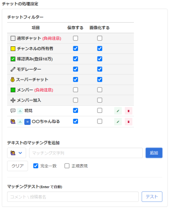

# Youtube Chat Recorder

YouTube のチャットがあるページ（ライブ、アーカイブ等）を開いた際に、チャットを監視し操作する拡張機能です。  
全ての機能はローカル環境で使用可能で、外部に送信されることはありません。  

## できること

- 特定のチャットの記録、保存、画像化
- 直近に閲覧した動画のリスト化

今後  

- チャットの強調、隠す機能
- サウンドを鳴らす機能
- スクリーンショット
- 統計機能
- 独自にチャットのデザインを指定して出力する

## 使い方

YouTube を見ていれば勝手に実行されます。  
古すぎるものは自動的に削除されるのでメンテナンスフリーです。  

この拡張機能を chrome にインストールした後、上部バーにピン留めして使用することを推奨します。  

### アイコン

右上に表示されているアイコンで稼働状態が分かります。  
また、チャットを取得したらバッジに取得数が表示されます。  

|アイコン|説明|
|:--:|:--|
||対象外のページか、エラーが発生しています|
||対象のページで待機中です(チャット欄が無い場合も)|
||チャットの監視が正常に行われています|
||取得したチャットの数 ポップアップを開くとリセットされます|

もし思わぬページでグレーの場合、とりあえずページを更新してください。  
F12を押した画面の「Console」に状態が出力されているので確認するのも有りです。  
それでも直らない際は作者まで連絡を頂けると幸いです。(オプションの目安箱)  

### チャットの保存方法

下記に説明がある「チャットフィルター」で指定したチャットが画面に表示された時、そのチャットを保存します。  
保存したチャットは右上のアイコンを選択し出てくるポップアップ画面で閲覧できます。  

この画面でチャットを選択し、「結合して保存」をすることで以下のような画像が生成できます。  
この時、ドロップダウンでチャットを抽出して「すべて選択」を押すと簡単です。  
※ 現時点ではチャットの上限を100件としています。(実装方法検討中)  
※ 生成画像の最大サイズは 16,384px 辺りなので、あまりに多い数（500以上？）を結合するとエラーを吐きます。 ([canvas - MDN](https://developer.mozilla.org/ja/docs/Web/HTML/Element/canvas "canvas"))  

「チャットの保存設定」の「取得できていないチャット画像を独自に生成する」 を ON にすると、画像が無いチャットを独自のデザインで出力します。(デフォルトだとスキップされる)  
また、「チャットの保存設定」の「全てのチャット画像を独自に生成する」 を ON にすると、全ての画像を独自のデザインで出力します。（「画像化する」を選ぶ必要が無くなる可能性。）  

※ 仮デザインです。（変えたい）  

### チャットマッチングフィルター

オプションの「チャットフィルター」で保存したいチャットを指定します。  
デフォルトのフィルターと、独自で条件を指定するフィルターが使用可能です。  

**`「保存する」`** は対象のチャットを文字として保存します。  
**`「画像化する`** は「保存する」に加えて表示されているまま、チャットのキャプチャをします。  

注意点

- 画面に表示されないと保存されません。（手動でスクロールしていて「↓」が表示されている場合は✕）
- なのでタブを開く際など、裏側に回ると保存できません。
- 独立したウインドウで表示することをおすすめします。
- 「画像化」は **表示されているまま** 、その場でキャプチャします。
  - ウインドウサイズを変更すると画像の大きさも変わります。
  - ロードした瞬間に表示されるコメントは画像化に失敗しやすいためスキップしています。（原因調査中）
  - テキストだけなら取得可能なので、もし必要ならば「チャットの保存設定」の「初めに表示されるチャットを処理する」を ON にしてください。

また、テキストマッチによる独自フィルターも使えます。  
追加したフィルタは「マッチングテスト」で反応するか確認できます。  

- 人モードにして、チャンネル名をコピペ、完全一致モードにすると、特定の人物のチャットを取り出す。
- 正規表現を使って長文を取り出す。（[正規表現 - MDN](https://developer.mozilla.org/ja/docs/Web/JavaScript/Guide/Regular_Expressions)）
- などなど...

## 免責事項

（一応）  
この拡張機能を使用したことで発生する問題について作者は一切の責任を取りません。  
常識的な使い方に留めておいてください。  
